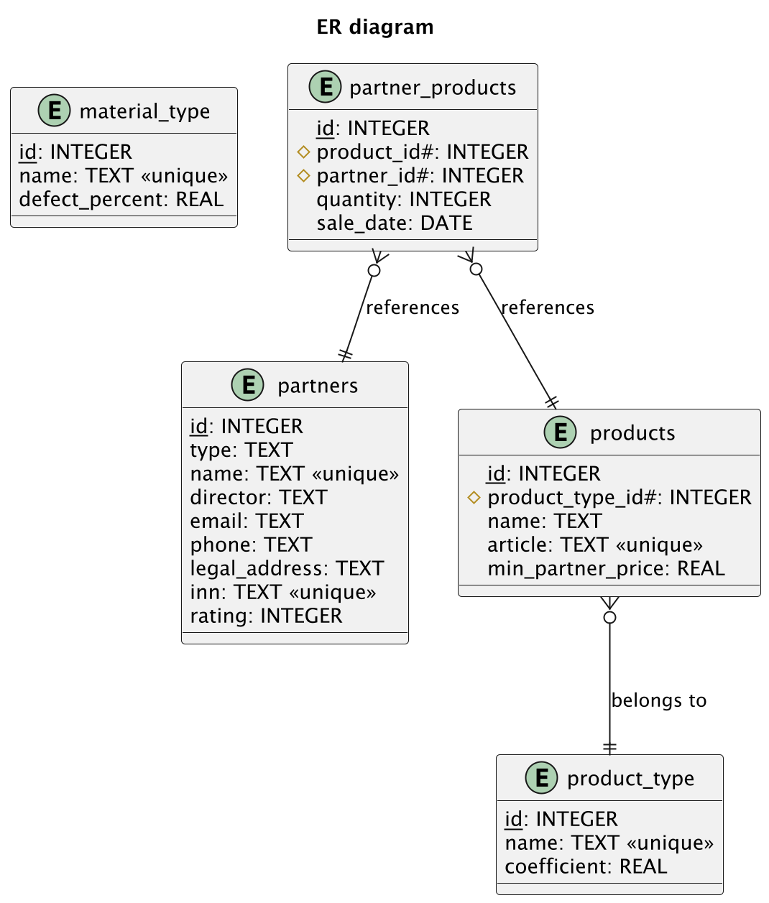
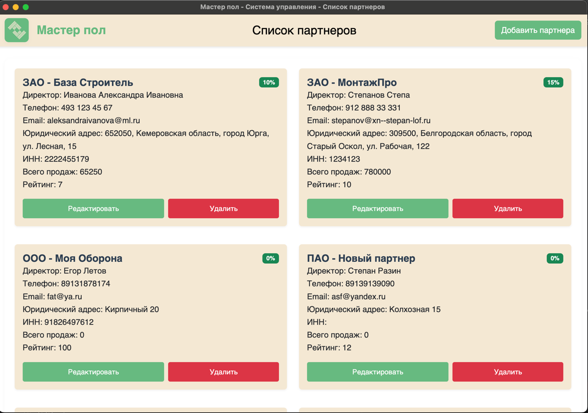

# Мастер Пол

Демо приложение для управления партнерами и их продуктами. Позволяет вести учет партнеров.

## Функциональность

- Управление партнерами (добавление, редактирование, удаление)
- Хранение контактной информации партнеров
- Отслеживание рейтинга партнеров

## Требования

- Node.js 18 или выше
- npm 9 или выше
- SQLite3

## Установка

1. Клонируйте репозиторий:
```bash
git clone git@github.com:loopguard/demo-partners-project.git
cd ~/demo-partners-project
```

2. Установите зависимости:
```bash
make install
```

## Запуск приложения

### Импорт данных в бд
```bash
import-data
```

### Режим разработки
```bash
make dev
```

### Прод режим
```bash
make start
```

## Сборка приложения

### Сборка для текущей платформы
```bash
make build
```

### Сборка для macOS
```bash
make build-mac
```

### Сборка для Linux
```bash
make build-linux
```

## Дополнительные команды

- `make clean` - очистка собранных файлов и node_modules
- `make lint` - запуск линтера
- `make test` - запуск тестов
- `make help` - показать список всех доступных команд

## Структура проекта

```
src/
├── database/         # Работа с базой данных
│   ├── migrations/   # SQL миграции
│   └── db.js         # Основной класс для работы с БД
├── main/            
│   └── main.js      # Точка входа приложения
└── renderer/        # Процесс рендеринга
    ├── index.html   # Основной HTML файл
    └── renderer.js  # Логика интерфейса
```

## База данных

Приложение использует SQLite для хранения данных. База данных автоматически создается при первом запуске приложения.

Основные таблицы:
- `partners` - информация о партнерах
- `partner_products` - информация о продажах продуктов
- `material_type` - справочник типов материалов
- `product_type` - справочник типов продуктов
- `products` - информация о продуктах

## ER диаграмма
Хранится в src/database в формате PDF


## UI приложения

